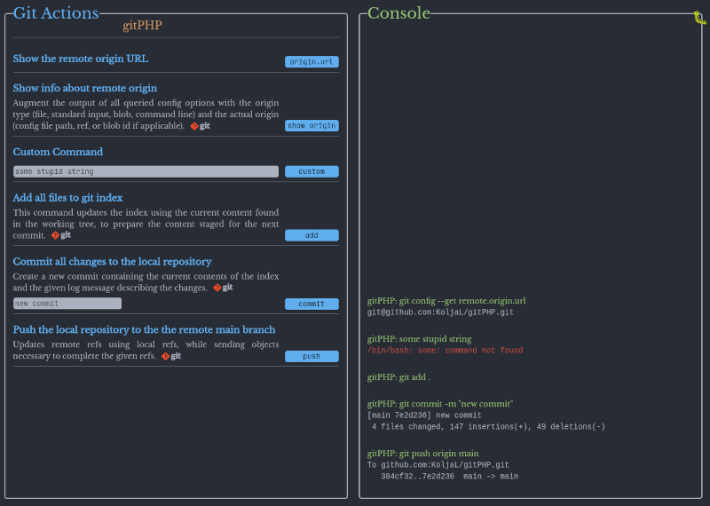

# gitPHP

GUI for using git without a shell.  
Uses [phpseclib](https://phpseclib.com) for SSH access without the dependence on the [PHP SSH2](https://www.php.net/manual/en/book.ssh2.php) extension.

## Screenshot

 

## ToDo List
- [x] custom Command datalist
- [x] mobile view
- [x] command history
- [x] one dark colors
- [x] highlighted error messages
- [x] password protection
- [x] scan folder for local repos
- [ ] close dropdown list
- [ ] git init
- [ ] add SSH Key
- [ ] create new repo
- [ ] rewrite the $repl array?
- [ ] clean CSS
- [ ] clean HTML